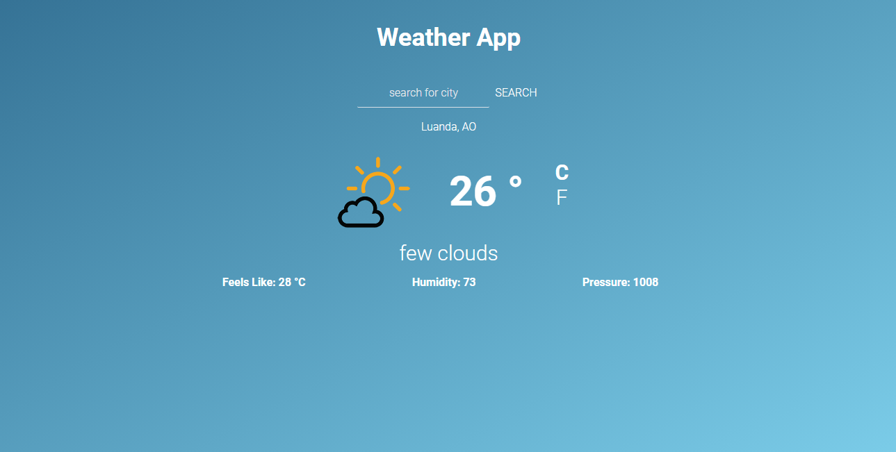

# Weather-app

## Table of contents

- [About](#about)
- [Features](#features)
- [Live Demo](#live-demo)
- [Built with](#built-with)
- [Getting started](#getting-started)
  - [Installation instructions](#installation-instructions)
- [Author](#author)
- [Show your support](#show-your-support)
- [License](#-license)

---

## About

This a weather app build using vanilla JavaScript that consumes data from the open weather API



## Features

The features of this project are, user can:

1. User as sees the information about his current location weather.
2. User can search for more than 200 cities around the world.
3. Users can change the metrics units by clicking on Celsius `C` and Farenheit `F` respectively.

## Live Demo

This project is hosted on Netlify.

[Live demo link](https://helciodev-weather-app.netlify.app/)

## Built With

- [](https://forthebadge.com)
- [](https://forthebadge.com)
- [](https://forthebadge.com)

## Getting Started

### Installation instructions

Follow along the steps below to get a copy at your local machine.

- Navigate to the directory where you want this project to clone and then clone it

  ```
  git clone git@github.com:helciodev/weather-app.git
  ```

- Navigate to the `weather-app` directory

  ```
  cd weather-app
  ```

- Install the npm package with `npm install`
- Start the server with `npm run start`
- The site should automatically open in your browser at http://localhost:8080/ if it didn't then open your browser with that link.

## Author

😎 **Helcio André**

- GitHub: [@helciodev](https://github.com/helciodev)
- Twitter: [@helcio_bruno](https://twitter.com/helcio_bruno)
- Linkedin: [Helcio Andre](https://www.linkedin.com/in/helcio-andre/)

## 🤝 Contributing

Contributions, issues, and feature requests are welcome!

## Show your support

Give a ⭐️ if you like this project!

## 📝 License

This project is [MIT](./LICENSE) licensed.
